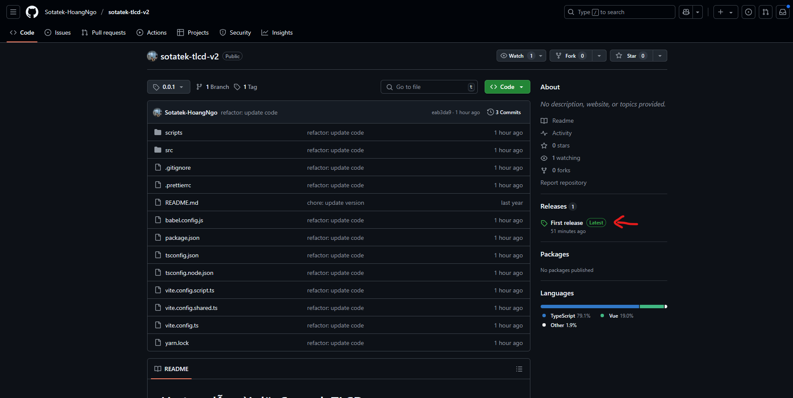
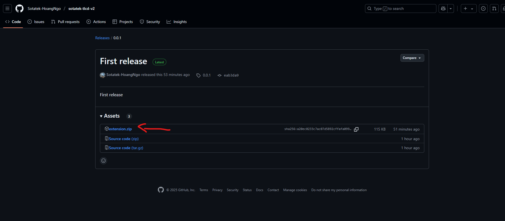
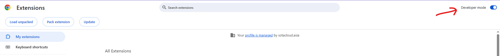
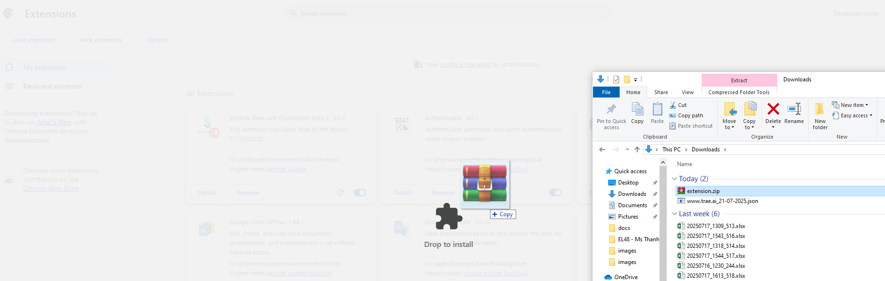

# Hướng dẫn cài đặt Sotatek TLCD

## Phiên bản

Bản cập nhật mới nhất: `1.1.3` (07/02/2024)

## Giới thiệu

Đây là một extension giúp cho việc theo dõi check-in check-out trong ngày một cách dễ dàng bằng Google Chat

## Hướng dẫn cài đặt

Để cài đặt extension, bạn có thể làm theo các bước sau:

1. Click vào phiên bản release có tag 'Latest'

2. Tải về file zip của extension

3. Mở Google Chrome và nhập chrome://extensions vào thanh địa chỉ.
4. Bật chế độ "Developer mode" bằng cách chọn ô vuông ở góc trên bên phải.

5. Kéo thả file zip vừa được tải vào khu vực bên trong All extension.

6. Extension sẽ được cài đặt và hiển thị trong trình duyệt của bạn.

Lưu ý: Hiện nay, các tool như extension này rất khó để được upload lên Google Chrome Store, vì vậy bạn cần phải sử dụng cách tạm thời này để cài đặt extension.
